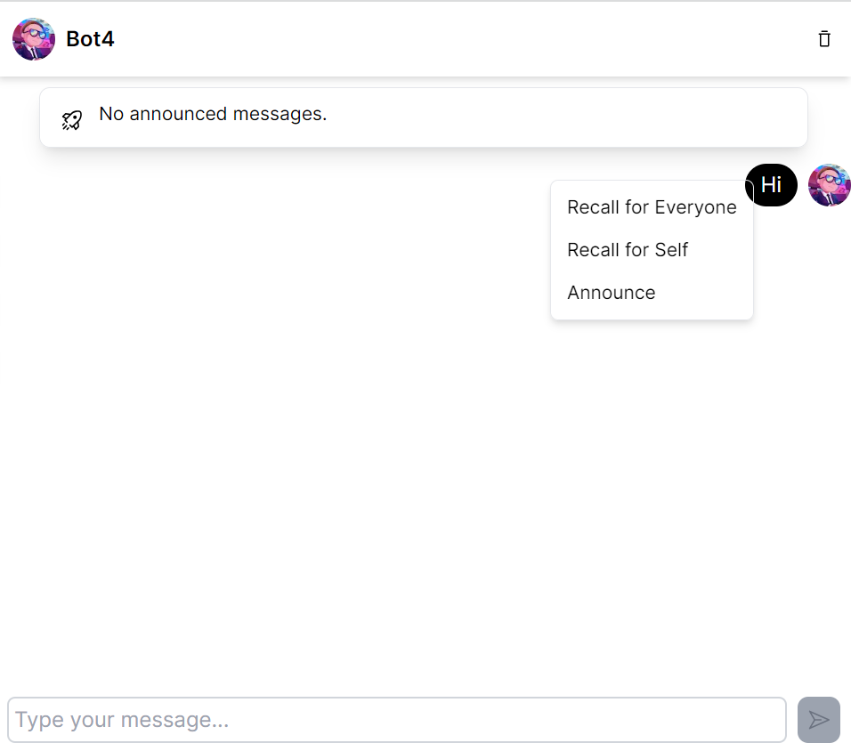

# Web Programming HW#4

## Project Overview

### Side Bar

1. **登入 & 登出**：
    1. 使用者可以透過輸入使用者名稱進行登入，並且可以登出。
    2. 使用者名稱必須唯一。


### Chat Page

1. **一對一聊天室**：
    1. 使用者可以在這個頁面總覽所有一對一聊天室。
    2. 進入本頁時，預設開啟最新的聊天室以及聊天紀錄
    
    3. 每一個聊天室能看到**對方的使用者名稱**以及**與對方的最後一則訊息**
    
    4. 點擊聊天室後，於右方開啟完整聊天紀錄。
    5. **搜尋**：可透過輸入任意使用者名稱，搜尋與該使用者的聊天室。若無與其之聊天室，則詢問使用者「是否新增聊天室？」。
    
    6. **新增**：可透過輸入任意使用者名稱，新增與該使用者的聊天室。若聊天室已存在，則提示使用者「聊天室已存在」。
    
    7. **刪除**：可刪除與任意使用者的聊天室，刪除時清除所有與該使用者的聊天紀錄。
    
2. **聊天紀錄**：
    1. 留言輸入框提示使用者可以輸入留言，當使用者 focused 在留言輸入框時，按下 enter 鍵即可發送訊息。(也可透過按送出按鈕發送)
    
    2. 自己的訊息發送後，會即時更新至畫面上，不需使用者重新整理。
    3. **來自其他用戶的訊息發送後，須立即顯示。**
    4. **收回功能**：
        1. 僅能收回該使用者自己發出的訊息
        2. 每則訊息皆支援兩種收回模式。在右鍵點擊訊息後，會詢問使用者欲使用何種收回模式：
            1. **向所有人收回**：收回後，所有在該聊天室的人皆無法再看到該則訊息。且此動作會即時更新並推播。
            2. **向自己收回**：收回後，所有在該聊天室的人仍可看到該則訊息，僅有該收回者無法再看到該則訊息。且此動作會即時更新並推播。
    
    5. **公告功能**：
        1. 可選定聊天記錄的任意一則訊息作為公告。
        2. 被設為公告的訊息，會顯示在聊天紀錄中清楚可見的位置。
        3. 每次僅能選擇一則訊息作為公告。若原來已有公告，則以新選擇的留言作為公告。
    

#### 即時更新的部分較難以截圖畫面說明，再麻煩您測試同時多個使用者時，皆從登入介面開始，且不要自行更改網址，感謝！

### 進階要求（Perfect）

1. **自動滾動**：當出現新訊息時，聊天紀錄會自動滾動至最下方。
2. **自編使用者頭貼**：點擊畫面左下角的使用者頭貼可更換頭貼，會存到資料庫，且可從資料庫讀取正確圖片。


# Install guide

## Environment variables
### Web

```
cd web
cp .env.example .env
```

在 .env 中的 POSTGRES_URL 填寫你的 db 網址。

### Server

```
cd server
cp .env.example .env
```

## Install packages
```bash
cd ./web
yarn
yarn migrate
cd ../server
yarn
cd ../package
yarn
```


# Run guide

1. Start the server
    ```bash
    cd ./server
    yarn dev
    ```
2. Start the web
    ```bash
    cd ./web
    yarn dev
    ```
3. Go to `http://localhost:3000` in your browser


**請記得清空資料庫！**
**請先填寫 Environment variables 再 Install packages 最後 Run guide**
**每個操作會需要等待一點時間，請等一項操作 load 完成，再進行其他操作。速度會受使用的 DB 類型以及作業系統影響，需麻煩您耐心等待，感謝！**